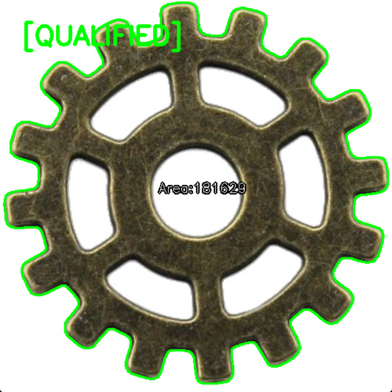
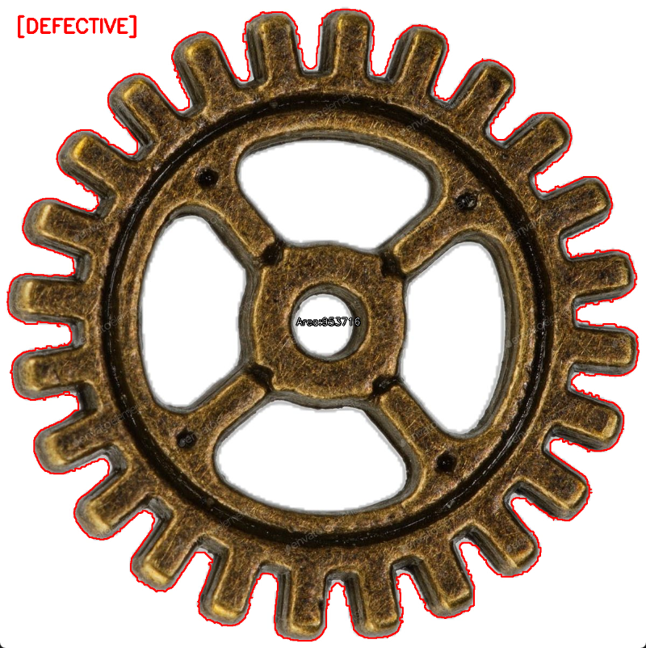

# Gear-AOI-Prototype: Industrial Gear Inspection System 
### 基于 Python + OpenCV 的工业齿轮自动检测原型 (A Vision-based Gear Inspection Tool)

---

## 🚀 项目简介 (Project Overview)
本项目是一个为工业流水线设计的自动光学检测（AOI）系统原型。主要解决了在生产线上，如何自动识别、定位并检测精密金属零件（如齿轮）是否存在缺损或质量问题。

This project is a prototype of an AOI system designed to automatically identify, locate, and inspect industrial gear parts for defects using Python and OpenCV.

## 🛠️ 核心功能与原理 (Technical Highlights)

### 1. 零件形状比对 (Shape Matching)
- **技术**: Hu-Moments (胡氏矩)
- **解决问题**: 利用数学上的旋转与缩放不变性 (Rotation and Scale Invariance)，解决了零件在传送带上**摆放角度不同**或离镜头**远近不一**导致的匹配失效问题，确保系统能精准“认出”零件。

### 2. 图像降噪与增强 (Image Preprocessing)
- **技术**: 多级形态学滤波 (Morphology)
- **解决问题**: 针对金属零件表面常见的**高光反射 (Glare)** 与**锈斑干扰**，通过调整卷积核 (Kernel) 参数，在去除杂质噪声的同时，保护了零件边缘的清晰度。

### 3. 重心定位与动态标注 (Centroid & Localization)
- **技术**: 图像矩 (Image Moments)
- **解决问题**: 实时计算零件的**物理重心 (Centroid)**：
  $$x = \frac{M_{10}}{M_{00}}, \quad y = \frac{M_{01}}{M_{00}}$$
  以中心点为基准实时跟随零件，确保检测结果的标签始终显示在零件上方。

### 4. 自动筛查逻辑 (Defect Detection)
- **逻辑**: Golden Sample (标准件比对)
- **解决问题**: 建立一个标准零件库，通过计算待测件与标准件之间的**形状差异得分 (Match Score)**。当得分超过设定阈值时，系统会自动拦截缺齿、变形等不合格产品。

## 📦 快速开始 (Quick Start)
1. **环境准备**: `pip install opencv-python numpy`
2. **准备样本**: 
   - 将标准件命名为 `gear_golden.jpg` 放入根目录。
   - 将待测样片放入指定文件夹。
3. **运行检测**: `python main.py`

## 📊 检测结果展示 (Inspection Results Showcase)

本系统采用严格的几何拓扑分析，可有效甄别外观细微差异。

The system utilizes strict geometric topology analysis to effectively identify subtle visual differences.

### 1. 合格样本 (Qualified Sample - PASS)
> 形状极其贴合，几何特征与黄金样本高度一致。

### 2. 不合格样本 (Defective Sample - REJECT)
> 虽然形状大致也是圆形，但由于铁锈纹理和diffuse边界，导致局部拓扑结构（方差）显著不一致，系统果断拦截。

